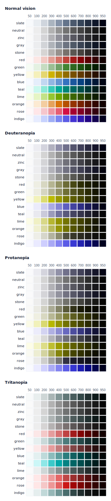

# Color math

Every color in Nexus is engineered, not picked. The system stores hex on disk, converts to OKLCH at build time, pins each shade's lightness to a shared perceptual grid, and gates every text-on-surface pairing with APCA contrast. This document explains how that works and what it costs.

## TL;DR

- **Every shade at the same step has the same perceptual lightness, regardless of palette.** `slate.500`, `stone.500`, and `neutral.500` are all exactly as light as each other — only their hue and chroma differ.
- **OKLCH plus a perceptual lightness grid make this true.** Source hex contributes hue and chroma; the lightness channel is overwritten from a hand-tuned grid shared by every palette.
- **APCA verifies it.** Every foreground/background pairing is checked against perceptual-contrast thresholds in CI, and a failing pair blocks the build.
- **Color-blind simulation re-runs the discrimination test for the ~8% of users with a color-vision deficiency.** Every shade and every status pair is checked against Brettel-simulated dichromacy — one finding, [tracked in #141](https://github.com/nexuslabs-ai/nexus/issues/141).

## Why this matters

A shade scale — `50` through `950` — carries an implicit promise: the number is a luminance coordinate. A designer reaching for "the 500" expects a mid-tone, and expects it to behave the same whether they are working in slate, stone, or zinc.

Off-the-shelf palettes break that promise. Tailwind's `slate.500` and `stone.500`, measured perceptually, do not share a lightness — one is meaningfully darker than the other. The number names a position in _that palette's_ hand-built ramp, not a shared luminance. The cost surfaces at handoff: a component that reads correctly in one palette loses contrast when re-themed to another, because "swap 500 for 500" silently changed the luminance underneath it.

Nexus fixes this at the source. The shade number _is_ a perceptual lightness coordinate, true by construction. Re-theming a component from slate to stone changes its hue and saturation and nothing else — every contrast relationship the designer established survives the swap. That property is what makes a multi-brand system safe to re-skin, and it is the reason the rest of this pipeline exists.

This is the same move Stripe documented in 2019 ([Designing accessible color systems](https://stripe.com/blog/accessible-color-systems)): they used the LCH color space — CIELAB's cylindrical form — to hold lightness constant across hues so their palette stayed legible. Nexus does the equivalent with OKLCH, a newer perceptual space that handles blues and purples more faithfully than LAB.

## OKLCH at runtime

The build emits every color as `oklch(L C H)`. OKLCH is a cylindrical, perceptually-uniform color space: **L** is lightness, **C** is chroma (saturation), **H** is hue. "Perceptually uniform" means equal numeric steps look like equal visual steps — the property HSL lacks and the one this whole system depends on.

Why OKLCH and not the alternatives:

| Space                  | Why not                                                                                                                                                                         |
| ---------------------- | ------------------------------------------------------------------------------------------------------------------------------------------------------------------------------- |
| HSL                    | Not perceptually uniform. HSL "lightness" varies wildly by hue — yellow at 50% reads far lighter than blue at 50%. Useless for pinning.                                         |
| CIELAB / LCH           | Perceptually uniform, but has a well-known blue-shift artifact: interpolating through blue bends toward purple. OKLCH (Ottosson, 2020) is the same cylindrical idea, corrected. |
| P3 / direct wide-gamut | A gamut, not a perceptual model. Solves "more colors," not "equal-looking steps." Orthogonal to the problem.                                                                    |

**On-disk format is hex, not OKLCH.** Token source files (`tokens/primitives/color.json` and the semi-transparent semantic overlay tokens) store plain hex strings. The reason is the Figma round-trip: Tokens Studio and Figma Variables hex-normalize color on export and cannot preserve an `oklch()` string. Hex is the only format that survives a designer editing a value in Figma and exporting it back. The OKLCH conversion happens at build time, in [`scripts/utils.js`](../scripts/utils.js) (`formatTokenValue`), routing through [`scripts/lib/perceptual-grid.js`](../scripts/lib/perceptual-grid.js).

**Browser floor: Baseline 2023.** OKLCH requires Chrome 111+, Safari 15.4+, and Firefox 113+. The build emits no hex fallback — a consumer targeting older browsers must pin to the last pre-OKLCH release tag (the reasoning is in [Trade-offs](#trade-offs)). Emitted values ship at Display P3 chroma; capable displays render full P3, legacy displays get the browser's automatic gamut map to sRGB. No `@media (color-gamut: p3)` query is needed.

## Perceptual lightness pinning

This is the core mechanism. When the build converts a palette shade, it does **not** trust the hex's lightness. It overwrites L with a value from a shared grid and keeps only the hue and chroma the designer chose.

The grid lives in [`scripts/lib/perceptual-grid.json`](../scripts/lib/perceptual-grid.json) — eleven L values, one per shade step, used by every palette:

| Shade | L     | Shade | L     |
| ----- | ----- | ----- | ----- |
| `50`  | 0.985 | `500` | 0.553 |
| `100` | 0.945 | `600` | 0.46  |
| `200` | 0.87  | `700` | 0.385 |
| `300` | 0.765 | `800` | 0.297 |
| `400` | 0.66  | `900` | 0.207 |
|       |       | `950` | 0.118 |

Conversion does three things to a shade hex:

1. **Lightness** — discarded from the hex, replaced by `grid[shade]`.
2. **Chroma** — taken from the hex, then clamped into the Display P3 gamut so the pinned color ships at full chroma on capable displays; only the over-P3 excess clips.
3. **Hue** — taken from the hex, preserved unchanged.

Because the grid is shared, `slate.500` and `stone.500` come out with identical L (`0.553`) and differ only in H and C. The perceptual-uniformity guarantee is made true by construction, not by hand-tuning each palette to match.

**Routing — which tokens get pinned.** A token is pinned when its path is at least two segments deep _and_ its last segment is a shade key (`50`–`950`). So `{palette}.{shade}` is pinned, and a future `chart.series.500` would be too. Everything else — pure white, black, the semi-transparent overlay tokens like `#000000cc` — is converted mechanically: a straight hex→OKLCH pass with no L override and alpha preserved. (A shade-key token with no palette root — a one-segment `500` — is treated as malformed: the build warns and falls through to mechanical conversion.)

> **Warning for designers.** When you pick a hex in Figma for a palette shade, **only its hue and chroma reach the generated CSS — the lightness is thrown away.** A vivid `#ff0000` and a dark `#400000` at the same shade key produce _identical_ lightness; only their hue and chroma differ. To change how light a shade is, edit `perceptual-grid.json`, not the hex. The hex is the wrong lever for lightness.

## APCA contrast gating

Pinning lightness guarantees consistency; it does not guarantee legibility. A perfectly consistent palette can still put unreadable text on a surface. The final gate is contrast, checked with **APCA** (the Accessible Perceptual Contrast Algorithm) rather than the WCAG 2.x ratio.

**Why APCA, not WCAG 2.x.** The WCAG 2.x contrast ratio is a simple luminance quotient. It is symmetric — it ignores whether text is dark-on-light or light-on-dark — and it is known to misrate mid-luminance and dark-mode pairs, passing some combinations that read poorly and failing some that read fine. APCA models _perceived_ lightness contrast and is polarity-aware, so it scores dark mode on its own terms. (APCA is the contrast method under development for WCAG 3.)

**Three tiers, by use.** A threshold that is right for body text is overkill for a divider label. The audit assigns each pair an intended-use tier:

| Tier           | Lc threshold | For                                                 |
| -------------- | ------------ | --------------------------------------------------- |
| **body**       | ≥ 75         | Fluent reading — `foreground ↔ background`          |
| **ui**         | ≥ 60         | Labels — buttons, badges, nav, chart marks          |
| **incidental** | ≥ 45         | De-emphasised text, dividers, disabled, focus rings |

APCA's Lc score is signed (positive for dark-on-light, negative for light-on-dark); the gate compares its absolute value to the threshold, so a pair passes on contrast magnitude regardless of polarity.

The audited pairs:

| Pair                                                                             | Threshold | Tier       |
| -------------------------------------------------------------------------------- | --------- | ---------- |
| `foreground ↔ background`                                                        | 75        | body       |
| `{primary,secondary,error,success,warning,information}-foreground ↔ -background` | 60        | ui         |
| _(same six)_ `-subtle-foreground ↔ -subtle`                                      | 60        | ui         |
| `nav-foreground ↔ nav-{background,item-hover,item-active}`                       | 60        | ui         |
| `chart.categorical.{1..5} ↔ {background,container}`                              | 60        | ui         |
| `muted-foreground ↔ muted`                                                       | 45        | incidental |
| `muted-foreground-subtle ↔ muted`                                                | 45        | incidental |
| `disabled-foreground ↔ disabled`                                                 | 45        | incidental |
| `nav-muted-foreground ↔ nav-background`                                          | 45        | incidental |
| `focus.color.{default,error} ↔ {background,container,popover}`                   | 45        | incidental |

Each pair is checked across every applicable base palette and brand, in **both** light and dark themes — a matrix of dozens of checks per run, not a single spot-check.

**The audit scores the sRGB-equivalent of what you ship.** This is the part that closes the loop. The audit runs each token through the OKLCH-pinning converter the build uses (`hexToSrgbInts` in [`scripts/lib/perceptual-grid.js`](../scripts/lib/perceptual-grid.js)), which re-clamps the (P3-emit) value into sRGB and scores the resulting `[r, g, b]`. APCA reads only RGB ints, and contrast must hold on the lowest-common-denominator display — a legacy sRGB screen — so the gate measures the sRGB projection of the shipped color. A pin that quietly broke contrast cannot pass. A pin that quietly broke contrast cannot pass.

A failing pair is not a threshold to lower. The thresholds come from APCA's published intended-use tiers and are fixed; a failure means the semantic token points at the wrong shade, or the grid L for that shade is wrong. Fix the reference or the grid — [`color-shades.md`](../../../.claude/rules/color-shades.md) maps which shade each role should use.

## Color-blind validation

Around 8% of men and 0.5% of women have a color-vision deficiency. APCA gates legibility for trichromat vision, but says nothing about whether two adjacent shades — or two status colors at the same step — survive the projection a dichromat's visual system performs. The chart palette (`teal / lime / orange / rose / indigo`) and the status palette (`success / warning / error` = `green / amber / red`) are the load-bearing cases: red/green confusion under deuteranopia is the textbook concern, and categorical chart series need to stay distinguishable across the same audience.

This is the discipline Stripe documented alongside their LCH palette in 2019 — they shipped color-blind simulations of every shade as part of the case for accessibility. The same property is checked here, mechanically, on every primitive palette.

**Methodology.** [`scripts/audit-colorblind.js`](../scripts/audit-colorblind.js) pulls every shade of every base, status, and chart palette (14 palettes × 11 shades), pins each through the same `hexToSrgbInts` converter the build uses, then simulates each under deuteranopia, protanopia, and tritanopia via [`@bjornlu/colorblind`](https://github.com/bluwy/colorblind) (a Brettel/Vienot/Mollon-based dichromacy model). For each (palette, vision-type) pair the audit measures OKLab ΔE between every adjacent shade (50↔100, 100↔200, …) and between every cross-status pair at shade 600 (`red.600 ↔ green.600`, etc. — the brand `-background` tier referenced by `error`, `success`, `warning`, and `information` in both themes). The threshold is **ΔE < 0.02** — OKLab's just-noticeable-difference floor; below it, two surfaces are effectively indistinguishable to a user with that deficiency.

Two caveats worth naming:

- **OKLab ΔE, not APCA Lc.** APCA's dark-pair contrast floors at 0 by design — text on a dark surface is unreadable regardless of luminance ratio, and APCA encodes that. But the question here isn't text legibility, it's whether two fills are distinguishable. APCA flagged 339 false positives on the same data (every dark-end adjacent pair, where the visual difference is real but APCA reports 0). OKLab ΔE answers the discrimination question uniformly across the luminance range, so it is the metric here.
- **Dichromacy is the worst case, not the common case.** Brettel models complete absence of one cone class (≤ 2% of the population combined across all three types). The much more common anomalous trichromacy (~6%) sees the same colors with reduced separation, not collapse. Passing dichromacy is the strict bound — anomalous trichromats clear the same audit by a margin.

**Current state.** The audit produces one finding on today's palette:

| Pair                     | Vision     | OKLab ΔE | Threshold | Tracked                                                  |
| ------------------------ | ---------- | -------- | --------- | -------------------------------------------------------- |
| `green.600` ↔ `blue.600` | Tritanopia | 0.0165   | 0.02      | [#141](https://github.com/nexuslabs-ai/nexus/issues/141) |

Both shades back the brand `-background` tier in both themes — `success.background` and `information.background` — so a tritanope (~0.01% prevalence) reads them as the same fill. The 420 within-palette adjacent-shade checks all pass, which is itself a credibility signal: the perceptual-grid pinning preserves L distinction even after dichromat projection. The single cross-status failure is the contract the system has bought; #141 owns the resolution.

The simulated grid (re-generated by the audit, deterministic across runs):



Rows are palettes (base / status / chart); columns are shades `50`→`950`; sections are vision types. The `green.600` and `blue.600` cells in the Tritanopia section visibly land at the same fill.

## Trade-offs

Every choice here gave something up. Naming the costs is the honest part:

- **No pre-2023 browsers.** OKLCH-only output means no support below Chrome 111 / Safari 15.4 / Firefox 113, and no hex fallback. A consumer who needs older browsers must pin to the last pre-OKLCH release tag. Emitting a hex fallback beside every OKLCH value was rejected: it doubles every declaration and silently reintroduces the per-hue lightness drift the pipeline removes.
- **Off-spec DTCG color values.** Token files keep `$value` as a hex string, not the DTCG 2025.10 structured-object form (`{ "colorSpace": "oklch", "components": [...] }`). The structured form is more correct on paper, but design tools write hex on export and would discard it on the next round-trip. Hex is the format that survives the Figma loop. Revisit if a downstream consumer ever needs spec-compliant import.
- **Chroma can clip.** Pinning L can push a vivid hue past what Display P3 can represent at that lightness. The converter clamps chroma to the P3 boundary, so an intensely saturated source can come out softer at extreme shades — though far less often than under the old sRGB clamp, since P3 is the strict superset. The build warns when chroma is reduced by more than 20%, surfacing the cases worth a designer's eye. This is the unavoidable cost of holding L fixed: you cannot always keep both the requested lightness and the requested saturation in-gamut.

## Verify locally

Run the contrast audit from the repo root:

```bash
yarn workspace @nexus/core audit:contrast
```

It prints one line per pair — `✓`/`✗`, the Lc score, the threshold, and the tier — then a summary count. It exits `0` when every pair passes and `1` on any failure, which is what gates CI.

Run the color-blind validation alongside it (re-generates [`color-math-colorblind.svg`](./color-math-colorblind.svg) deterministically):

```bash
yarn workspace @nexus/core audit:colorblind
```

It prints one section per CB type per audit kind (adjacent-shade collapse, cross-status pair confusability) and exits `0` when clean, `1` on any finding. Not yet wired to CI — findings are documented inline above and tracked as separate issues.

To read the engineering directly:

- [`scripts/lib/perceptual-grid.js`](../scripts/lib/perceptual-grid.js) — hex→OKLCH conversion, the L override, chroma clamping, and the `hexToSrgbInts` helper the audit shares with the build.
- [`scripts/lib/perceptual-grid.json`](../scripts/lib/perceptual-grid.json) — the eleven L values. Editing one retunes that shade across every palette.
- [`scripts/audit-contrast.js`](../scripts/audit-contrast.js) — the pair list, the tier thresholds, and the matrix loop.
- [`scripts/audit-colorblind.js`](../scripts/audit-colorblind.js) — the CB simulation pipeline, the OKLab ΔE threshold, and the SVG emitter.

To add a new audited pair, add a `{ fg, bg, minLc, tier }` entry to the relevant pair list in `audit-contrast.js`. The audit throws if either token is missing from the file it checks, so a typo or a renamed token fails loudly rather than skipping silently.

The pinning and audits run on `apca-w3`, `culori`, and `@bjornlu/colorblind`; all three are pinned in `packages/core/package.json`.

## References

External:

- Stripe (2019) — [Designing accessible color systems](https://stripe.com/blog/accessible-color-systems) — inspiration for both the LCH-style lightness pinning and the published color-blind validation
- [APCA — easy intro](https://git.apcacontrast.com/documentation/APCAeasyIntro.html), source of the contrast tiers
- Björn Ottosson (2020) — [A perceptual color space (OKLab / OKLCH)](https://bottosson.github.io/posts/oklab/)
- Brettel, Viénot & Mollon (1997) — _Computerized simulation of color appearance for dichromats_ ([J. Opt. Soc. Am. A, vol. 14, no. 10](https://doi.org/10.1364/JOSAA.14.002647)), the algorithm `@bjornlu/colorblind` implements
- [Vercel Geist colors](https://vercel.com/geist/colors) and [Radix Colors](https://www.radix-ui.com/colors) — published per-step color semantics

Internal (deeper, agent-facing):

- [`.claude/rules/tokens.md`](../../../.claude/rules/tokens.md) § Color Token Pipeline — the build-side spec this document narrates
- [`.claude/rules/color-shades.md`](../../../.claude/rules/color-shades.md) — what each `50`–`950` shade is for, per role
- [`.claude/rules/surfaces.md`](../../../.claude/rules/surfaces.md) — the surface stack the contrast pairs are built on
